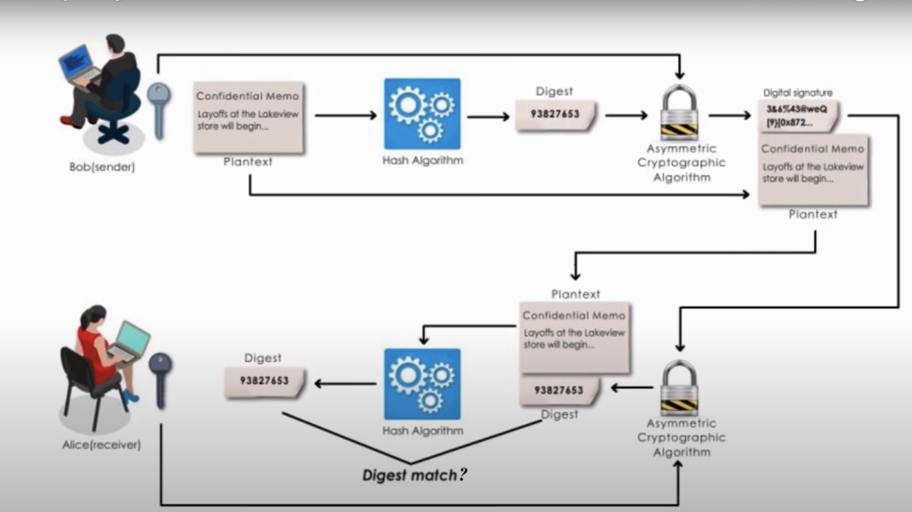

# Digital Signature Illustration

## What
This is an illustration of a digital signature. This experiment includes classic Alice and bob.
They want to communicate over a network, but we know that it is always possible that someone eavesdropping and changing the message. To solve this problem we've used asymmetric keys. So bob would sign the message using his private key and Alice (or anyone) could use the public key to verify the signature.
Cryptographically we decrypt the message using a private key to sign a message and encrypt the message using a public key for verification.



## Why
Broadly digital signatures have 3 purposes
1. Authentication: It ensures the authenticity of the sender.
2. Non-repudiation: It ensures that the sender has sent the message and they can not deny it later on
3. Integrity: It ensures that the message has not been altered.

## Setup
```
foo@bar:~$ make setup
foo@bar:~$ make run_alice
foo@bar:~$ make run_bob
```

## References:
* https://www.youtube.com/watch?v=TmA2QWSLSPg&ab_channel=SunnyClassroom
* https://www.thedigitalcatonline.com/blog/2018/04/25/rsa-keys/
